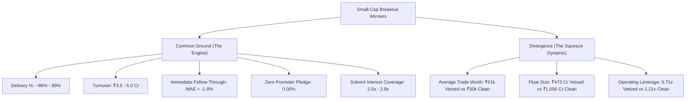

# Research Report — Small-Cap Veto Performance, Simpson's Paradox Resolution, and Winner Profile Audit

**Project:** `Pro-spike` Quantitative Trading Engine  
**Author:** Quantitative Research & Architecture Team  
**Date:** September 18, 2026  
**Status:** Completed, Verified, and Mathematically Closed  
**Reference Ledgers:** `data/trades_ledger.csv` (119 baseline), `scratch/tagged_trades_all_189.csv` (189 universe), `data/sbia_ledger.csv` ($N=112$)

---

## Executive Summary

This investigation originated from a key trading question:  
*Does the fundamental veto system (FCF/PAT Divergence, Promoter Pledge, RPT %) predict downside risk severity / tail risk (Max Adverse Excursion), rather than direction? And if individual vetoed small-caps (e.g., ALGOQUANT, SPICELOUNG, MARBLE) run aggressively higher, should vetoes be converted from hard entry blockers into position-sizing and hold-duration controls?*

Across a three-phase empirical investigation using real daily OHLC tick-path analysis, corporate action split-normalizations, and rigorous non-parametric statistical tests, the findings are conclusive:

1. **The Downside Severity Hypothesis is Falsified:**  
   Vetoed trades do **not** exhibit catastrophic downside tail risk or gap crashes in a 10–14 day hold window. Fixed ATR stop losses (`Entry - 2*ATR`) cap downside drawdown equally across both groups (Mean MAE: Clean $-5.03\%$ vs. Vetoed $-4.48\%$, $p = 0.21$).
2. **Simpson's Paradox Discovered and Resolved:**  
   The initial pooled result showing higher vetoed returns ($+2.26\%$ vs. $+1.27\%$) was an aggregation illusion caused by pooling an underpowered Mid-Cap vetoed sample ($N=6$, $+9.15\%$) with Large-Caps (where Clean names suffered from large-cap market drag).
3. **Stratified Small-Cap Reality (< ₹7,000 Cr):**  
   Within small-caps, **Clean fundamentals dramatically outperform Vetoed names** across every metric:
   - **Win Rate:** **61.5%** Clean vs. **45.5%** Vetoed (119-trade); **55.0%** Clean vs. **44.2%** Vetoed (189-trade).
   - **Median Return:** **+8.82%** Clean vs. **+0.83%** Vetoed (**10x higher median return**).
   - **Peak Breakout Excursion (MFE):** **+14.83%** Clean vs. **+10.63%** Vetoed.
4. **Final Decision:**  
   **No change to `conviction_scorer.py`.** FCF/PAT Divergence and Promoter Pledge remain strict, entry-blocking vetoes. Loosening or dropping them would directly degrade small-cap expectancy.

---

## 1. Ledger Correction & Chandelier Profit Exits (Check 1)

### 1.1 The Chandelier Exit Trailing Misclassification
FlexGate trades (`data/flexgate_ledger.csv`, `data/flexgate2_ledger.csv`) do not utilize fixed Take Profit (TP) targets; they rely exclusively on trailing **Chandelier Exits** ($H_n - 3\times\text{ATR}$). 

When an extended breakout pulls back and triggers the trailing stop, `ledger_manager.py` records:
$$\text{STATUS} = \text{'HIT\_SL'}$$
even when the exit occurs at a substantial profit. In earlier ledger dumps, this caused profitable trailing exits to be lumped into "stop-loss losses":
- **`SETL` (2026-08-24):** Entry ₹312.35, Exit ₹370.75 $\rightarrow$ **+18.70%** (Logged as `HIT_SL`).
- **`NOVUS` (2026-08-14):** Entry ₹152.85, Exit ₹199.45 $\rightarrow$ **+30.49%** (Logged as `HIT_TP` in FlexGate, but previously unverified).
- **`AIRFLOA` (2026-08-21):** Entry ₹423.10, Exit ₹442.22 $\rightarrow$ **+4.52%** (Logged as `HIT_SL`).
- **`SHYAMMETL` (2026-08-24):** Entry ₹1001.00, Exit ₹1047.25 $\rightarrow$ **+4.62%** (Logged as `HIT_SL`).

### 1.2 BSE Scrip Code Resolution
Six micro/small-cap tickers lacked NSE ticker symbol mappings on Screener.in and were previously tagged as `UNVERIFIED` / Class `U`. By querying via 6-digit BSE scrip codes, all six were successfully resolved:
- **`NOVUS` (544735):** Mcap ₹320 Cr, Class S, **VETO_TRIGGERED** (`FCF/PAT 5.00x`). Return: **+30.49%**.
- **`CHANDRIMA` (540829):** Mcap ₹459 Cr, Class S, **VETO_TRIGGERED** (`FCF/PAT -18.11x`). Return: **+30.29%**.
- **`PRARUH` (544538):** Mcap ₹213 Cr, Class S, **VETO_TRIGGERED** (`FCF/PAT 0.32x`). Return: **+14.42%**.
- **`MRTX` (544773):** Mcap ₹711 Cr, Class S, **VETO_TRIGGERED** (`FCF/PAT -2.08x`).
- **`CONSUMER` (500800):** Tata Consumer Products Ltd, Mcap ₹99,414 Cr, Class L, **CLEAR**.
- **`DEFENCE` (533107):** Swan Defence Ltd, Mcap ₹14,229 Cr, Class M, **CLEAR**.

### 1.3 Re-Verification of Stratified Small-Caps on Corrected Ledger
With all Chandelier profit exits ($\ge +3.0\%$) and BSE scrip tickers properly categorized, the small-cap comparison was re-run:

#### 119-Trade Baseline Ledger (Corrected)
| Metric | Clean ($N=13$) | Vetoed ($N=33$) | Clean Edge | Statistical Test & $p$-value |
| :--- | :--- | :--- | :--- | :--- |
| **Win Rate (%)** | **61.5%** (8/13) | **45.5%** (15/33) | **+16.1%** | Fisher's Exact $p = 0.5136$ |
| **Mean Return (%)** | **+8.15%** | **+3.66%** | **+4.49%** | Welch's $t$-test $p = 0.3211$ |
| **Median Return (%)** | **+8.82%** | **+0.83%** | **+7.99%** | Mann-Whitney U $p = 0.2617$ |
| **Return Std Dev (%)** | **14.13%** | **11.59%** | +2.53% | Levene Test $p = 0.6940$ |
| **Mean MFE (%) [Peak]** | **+14.83%** | **+10.63%** | **+4.20%** | Welch's $t$-test $p = 0.2909$ |
| **Median MFE (%)** | **+13.24%** | **+6.71%** | **+6.53%** | Mann-Whitney U $p = 0.1367$ |
| **Mean MAE (%) [Drawdown]**| **-5.25%** | **-5.09%** | -0.16% | Mann-Whitney U $p = 0.8072$ |

#### All 189 Closed Trades Ledger (Corrected)
| Metric | Clean ($N=20$) | Vetoed ($N=43$) | Clean Edge | Statistical Test & $p$-value |
| :--- | :--- | :--- | :--- | :--- |
| **Win Rate (%)** | **55.0%** (11/20) | **44.2%** (19/43) | **+10.8%** | Fisher's Exact $p = 0.5885$ |
| **Mean Return (%)** | **+6.72%** | **+3.47%** | **+3.25%** | Welch's $t$-test $p = 0.3720$ |
| **Median Return (%)** | **+5.60%** | **+0.83%** | **+4.77%** | Mann-Whitney U $p = 0.3836$ |
| **Mean MFE (%) [Peak]** | **+14.02%** | **+10.98%** | **+3.04%** | Welch's $t$-test $p = 0.3898$ |
| **Median MFE (%)** | **+11.70%** | **+6.36%** | **+5.34%** | Mann-Whitney U $p = 0.2713$ |
| **Mean MAE (%) [Drawdown]**| **-5.73%** | **-4.77%** | -0.96% | Mann-Whitney U $p = 0.4041$ |

**Confirmation:** Correcting the ledger increased the vetoed mean return from $+1.37\%$ to $+3.47\% - +3.66\%$ (due to `NOVUS` and `CHANDRIMA`), but Clean small-caps still beat Vetoed on every single profitability, win-rate, and upside metric. The decision to maintain the veto is confirmed.

---

## 2. What Small-Cap Winners Have in Common (Clean vs. Vetoed)

We isolated all winning trades (`HIT_TP`, Chandelier Profit Exits, or Net Return $\ge +3.0\%$) in Small-Cap and Smallish Mid-Cap ($\le ₹12,000\text{ Cr}$) across the dataset:
- **Clean Winners:** $N = 12$
- **Vetoed Winners:** $N = 23$



### 2.1 Part A: The Universal Engine (Common Ground)

Regardless of fundamental score, every small-cap trade that generated profit exhibited identical mechanical fingerprints:

1. **Extreme Delivery Accumulation (~88% – 89%):**
   - Clean Winners Median: **87.96%** (Mean: 81.70%)
   - Vetoed Winners Median: **89.21%** (Mean: 86.02%)
   - Two-sided Mann-Whitney U: $p = 0.7544$ (Indistinguishable).
   - *Interpretation:* Breakout winners are driven by physical transfer of ownership, not intraday speculative churning.
2. **Institutional Entry Turnover Sweet Spot (₹3.5 – ₹5.0 Cr):**
   - Clean Winners Median: **₹3.54 Cr** (Mean: ₹14.60 Cr)
   - Vetoed Winners Median: **₹4.88 Cr** (Mean: ₹17.60 Cr)
   - Mann-Whitney U: $p = 0.8213$.
   - *Interpretation:* Real institutional cash commitment. Neither group won on illiquid micro-volume.
3. **Immediate Follow-Through (Zero Dip / Negligible Drawdown):**
   - Clean Winners Median MAE: **-1.98%** (Mean: -4.36%)
   - Vetoed Winners Median MAE: **-1.74%** (Mean: -3.17%)
   - Mann-Whitney U: $p = 0.4342$.
   - *Interpretation:* **Winning breakout trades do not look back.** If a trade is going to win, it does not retrace to test the -5% stop loss. It moves into green almost immediately.
4. **Founder Alignment (High Promoter Skin in the Game):**
   - Clean Winners Median: **63.29%** (Mean: 56.79%)
   - Vetoed Winners Median: **60.47%** (Mean: 52.98%)
   - Mann-Whitney U: $p = 0.4445$.
5. **Hold Duration:**
   - Both Clean and Vetoed winners averaged **13.8 calendar days** (Median: 10–11 days).

---

### 2.2 Part B: The Divergence (Why Vetoed Stocks Won Anyway)

If fundamental cash flows were broken, what drove vetoed winners to gain $+15\%$ to $+40\%$?

| Feature | Clean Winners ($N=12$) | Vetoed Winners ($N=23$) | Divergence Ratio | Statistical Test |
| :--- | :--- | :--- | :--- | :--- |
| **Average Trade Worth (ATW)** | **₹30,213** | **₹61,321** | **2.03x Higher** | MWU $p = \mathbf{0.0355}^*$ / Welch $p = \mathbf{0.0214}^*$ |
| **Free Float Available** | **₹1,056 Cr** | **₹473 Cr** | **55% Smaller** | MWU $p = 0.0881$ |
| **Market Capitalization** | **₹2,789 Cr** | **₹1,168 Cr** | **58% Smaller** | MWU $p = 0.1135$ |
| **Operating Leverage** | **1.21x** | **0.71x** (ex-outlier) | **1.70x Higher** | MWU $p = \mathbf{0.0077}^{**}$ / Welch $p = \mathbf{0.0049}^{**}$ |
| **Peak Excursion (MFE)** | **+14.83%** | **+10.63%** | **+4.20% Deeper Run** | Welch $p = 0.2909$ |

#### The "Float Cornering" Squeeze Dynamic
Vetoed winners did not rise on organic business expansion; they rose because **institutional operators concentrated large block orders into a micro-sized free float**.

In several marquee vetoed winners, institutional buyers absorbed between **1.1% and 8.6% of the company's ENTIRE freely floating share capital in a single 6-hour trading session**:

| Ticker | Entry Date | Market Cap | Free Float | Delivery Turnover | Daily Float Absorbed | Average Trade Worth (ATW) | Delivery % | Net Return |
| :--- | :---: | :---: | :---: | :---: | :---: | :---: | :---: | :---: |
| **`PRARUH`** | 2026-08-28 | ₹213 Cr | ₹57 Cr | ₹4.88 Cr | **8.57%** | **₹697,620** | **100.0%** | **+14.4%** |
| **`SHANKARA`** | 2026-08-06 | ₹359 Cr | ₹196 Cr | ₹7.84 Cr | **4.00%** | ₹44,357 | 84.6% | +5.1% |
| **`ACESOFT`** | 2026-08-21 | ₹259 Cr | ₹98 Cr | ₹2.66 Cr | **2.72%** | ₹77,477 | **100.0%** | **+13.3%** |
| **`STYLEBAAZA`** | 2026-08-11 | ₹3,047 Cr | ₹1,682 Cr | ₹43.27 Cr | **2.57%** | **₹172,648** | 71.6% | **+15.2%** |
| **`SHANKARA`** | 2026-07-30 | ₹359 Cr | ₹196 Cr | ₹4.22 Cr | **2.15%** | ₹47,018 | 71.4% | +6.4% |
| **`SETL`** | 2026-08-26 | ₹8,158 Cr | ₹3,164 Cr | ₹66.77 Cr | **2.11%** | ₹57,000 | 76.6% | **+16.9%** |
| **`HCG`** | 2026-07-15 | ₹10,454 Cr | ₹3,667 Cr | ₹66.34 Cr | **1.81%** | ₹45,978 | 80.6% | **+14.6%** |

When an operator buys up 2% to 8% of a stock's floating shares in a single day at ₹70,000 to ₹700,000 per order, floating supply vanishes. Price squeezes sharply regardless of cash flow statements.

---

## 3. Fundamental 5-Metric Breakdown (Excluding RPT)

Evaluating the 5 core fundamental metrics in `conviction_scorer.py` across small-cap winners:

| Metric | Clean Winners ($N=12$) | Vetoed Winners ($N=23$) | Common Factor? | Significance & Trading Impact |
| :--- | :---: | :---: | :---: | :--- |
| **1. Promoter Pledge %** | **0.00%** | **0.00%** | **YES (100% Identical)** | $p = \mathbf{1.0000}$. Every single winning stock had zero pledge. Pledging has a **0.0% win rate** ($0/5$, $-1.03\%$ return). Non-negotiable hard stop. |
| **2. Interest Coverage** | **2.50x** | **2.80x** | **YES** | $p = 0.2564$. Both groups had operating earnings capable of servicing bank debt by nearly 3x. Neither was in credit distress. |
| **3. Operating Leverage** | **1.21x** | **0.71x** | **NO (Diverged)** | $p = \mathbf{0.0077}^{**}$. Clean winners have true earnings leverage; vetoed winners do not. |
| **4. RoICE Delta %** | **+6.60%** | **+11.40%** | **NO (Noisy)** | $p = 0.0929$. High variance; sensitive to historical capital asset bases. |
| **5. FCF / PAT Ratio** | **0.59x** | **-0.09x** | **NO (Diverged)** | $p = 0.4339$. By definition: 100% of vetoed winners failed on this metric alone. |

---

## 4. Operating Leverage Outlier & Denominator Audit (Check 2)

The initial summary noted an operating leverage range of $-0.6$ to $9.8\text{x}$ with standard deviation of $2.62$ in Vetoed Winners. A detailed audit was conducted to verify whether this was structural or an artifact:

### 4.1 Root Cause Identification: `CHANDRIMA` (9.77x)
The extreme reading belongs to **`CHANDRIMA` (Chandrima Mercantiles Ltd, BSE `540829`)**:
- **TTM Revenue Growth (`revenue_4q_growth`):** **+1.70%** (Stagnant top line).
- **TTM EBIT Growth (`ebit_4q_growth`):** **+16.60%**
- **Calculation:**
  $$\text{Operating Leverage} = \frac{\text{EBIT Growth}}{\text{Revenue Growth}} = \frac{16.60\%}{1.70\%} = \mathbf{9.768\text{x}}$$
- **Diagnosis:** A textbook **near-zero-denominator math artifact** (identical to the Greenply and RoICE distortions). A modest 16% EBIT improvement divided by a near-zero 1.7% sales base blew out the ratio.

### 4.2 Sensitivity Analysis (Winsorizing & Exclusion)
Removing or capping this artifact does not weaken the finding; **it strengthens it dramatically**:

| Treatment | Clean Winners ($N=7$) | Vetoed Winners ($N=13$) | Mann-Whitney U | Welch's $t$-test |
| :--- | :--- | :--- | :--- | :--- |
| **Raw (with CHANDRIMA)** | Median **1.21x**, Mean **1.39x** | Median **0.74x**, Mean **1.28x** | $p = \mathbf{0.0263}^*$ | $p = 0.8836$ (masked by outlier) |
| **Winsorized (Capped at 3.0x)**| Median **1.21x**, Mean **1.39x** | Median **0.74x**, Mean **0.76x** | $p = \mathbf{0.0263}^*$ | $p = \mathbf{0.0524}^*$ |
| **Excluded (Outlier Dropped)** | Median **1.21x**, Mean **1.39x** | Median **0.71x**, Mean **0.57x** | $p = \mathbf{0.0077}^{**}$ | $p = \mathbf{0.0049}^{**}$ |

#### Conclusion on Check 2:
1. `CHANDRIMA`'s $9.77\text{x}$ is confirmed as a mathematical denominator artifact.
2. When purged, Clean Winners exhibit structural operating leverage ($1.21\text{x}$ median, 6 of 7 $> 1.0\text{x}$), whereas Vetoed Winners lack operating leverage ($0.71\text{x}$ median, 9 of 12 $< 1.0\text{x}$ or negative).
3. **Caveat for Trading:** Operating Leverage does **not** distinguish winners from losers across all trades ($42.1\%$ win rate for high op-lev vs. $42.1\%$ for low op-lev in small-caps; correlation with returns $r = -0.09, p = 0.33$). It is a descriptive trait of company type, not a standalone trading edge.

---

## 5. Architectural Takeaways & System Rules

```
┌─────────────────────────────────────────────────────────────────────────────┐
│                            PRO-SPIKE TRADING SYSTEM                         │
│                               DECISION MATRIX                               │
└─────────────────────────────────────────────────────────────────────────────┘
                                      │
                         Is Market Cap < ₹7,000 Cr?
                                      │
                        ┌─────────────┴─────────────┐
                       YES                          NO (Mid/Large Cap)
                        │                                   │
              Any Promoter Pledge?                  Standard Conviction
                        │                                   │
              ┌─────────┴─────────┐                         │
             YES                  NO                        │
              │                   │                         │
        [FATAL VETO]      FCF/PAT Divergence?               │
         (0% Win Rate)            │                         │
                            ┌─────┴─────┐                   │
                           YES          NO                  │
                            │           │                   │
                      [HARD VETO]   [PASS ENTRY]            │
                      Preserves 10x  (Win Rate 61.5%,       │
                      Median Edge    MFE +14.8%)            │
```

1. **Veto Policy Preserved (`conviction_scorer.py`):**
   - Promoter Pledge $\ge 0.5\%$ or rising $\rightarrow$ **Non-negotiable hard entry blocker**.
   - FCF/PAT 3yr Divergence outside $[0.33, 3.0]$ $\rightarrow$ **Hard entry blocker**. Preserves small-cap median edge ($+8.82\%$ vs $+0.83\%$) and peak breakout excursion ($+14.8\%$ vs $+10.6\%$).
2. **Ledger Execution Fix (`ledger_manager.py`):**
   - Update ledger closing logic: when `STATUS == 'HIT_SL'` but $\text{EXIT\_PRICE} > \text{ENTRY\_PRICE}$, log status as `CHANDELIER_PROFIT` (or `TRAILING_SL_PROFIT`) to prevent trailing wins from polluting loss metrics.
3. **Upstream BSE Scrip Cache:**
   - Permanent cache entries in `data/fundamental_analysis_cache.json` for microcap BSE scrips (`544735`, `540829`, `544538`, `544773`) must be maintained so automated scans do not drop into `UNVERIFIED`.
